# test-go

## Development

### Before you begin

For a simpler and quicker start:

- install [mise-en-place](https://mise.jdx.dev/installing-mise.html),
- run `mise install`.

[./mise.toml](./mise.toml) is referencing the different development tools used in that project.

### Push a change

```bash
git clone https://github.com/crazy-matt/test-go.git
task setup
# make your change...
yarn test
# or
task getready
```

### Release Process

This project uses [Release Please](https://github.com/googleapis/release-please) to automate releases based on [Conventional Commits](https://www.conventionalcommits.org/).

```mermaid
flowchart TD
    user1(["👤 Releaser"]) --> |Creates PR| PR
    user2(["👤 Releaser"]) --> |Pushes to main| Push

    subgraph "Pull Request Workflow"
        PR[Pull Request Created] --> PRTests[Run Tests & Linting]
        PRTests --> PRMerge[Merge to main branch]
    end

    subgraph "Release Please Workflow"
        Push[Push to main] --> Tests[Run Tests & Linting]
        Tests --> Check[Release Please Check]
        Check -- "Release Needed" --> Create[Create Release PR]
        Check -- "No Release" --> End[End Workflow]
        Create --> Build[Build Action]
        Build -- "Refresh with recent changes pushed to trunk" --> Build
        Build --> Merge[Auto or Manual Merge]
        Merge --> Release[Create GitHub Release]
        Release --> Tags[Create/Update Major & Minor Tags]
        Release --> Security[Upload SBOM]
    end

    PRMerge --> Push

    style Release fill:#9cf,stroke:#333
    style Tags fill:#9cf,stroke:#333
    style user1 fill:#f96,stroke:#333,stroke-width:2px
```

<div align="center">



</div>

#### How It Works

1. **Commit Message Format**

   All commit messages should follow the conventional commits format:

   ```bash
   type(scope): description
   ```

   Common types:

   - `feat`: A new feature (triggers a minor version bump)
   - `fix`: A bug fix (triggers a patch version bump)
   - `docs`: Documentation changes
   - `chore`: Routine tasks, maintenance
   - `perf`: Performance improvements
   - `security`: Security fixes (triggers a patch version bump)

   Breaking changes:

   ```bash
   feat(scope)!: description

   BREAKING CHANGE: explanation
   ```

   This triggers a major version bump.

2. **Pull Requests**

   When pull requests are opened against the main branch, tests automatically run to validate changes.

3. **Automated Release Process**

   When changes are pushed to the main branch:

   - Tests run to ensure code quality
   - Release Please analyzes commits since the last release
   - If releasable changes are found, a release PR is created or updated
   - The release PR includes version bumps and an updated CHANGELOG
   - When the release PR is merged, a new GitHub release is created
   - The action is built and attached to the release
   - Major and minor version tags are automatically updated

4. **Version Tags**

   For every release (e.g., v1.0.0), we maintain:

   - A specific version tag (v1.0.0)
   - A minor version tag (v1.0) that points to the latest patch
   - A major version tag (v1) that points to the latest minor/patch

5. **Force Release**

   You can use `"release-as": "1.2.3"` in the [Release Please manifest](./github/release-please-config.json) to force a release for a specific version. Once the release PR is merged you should remove this.
